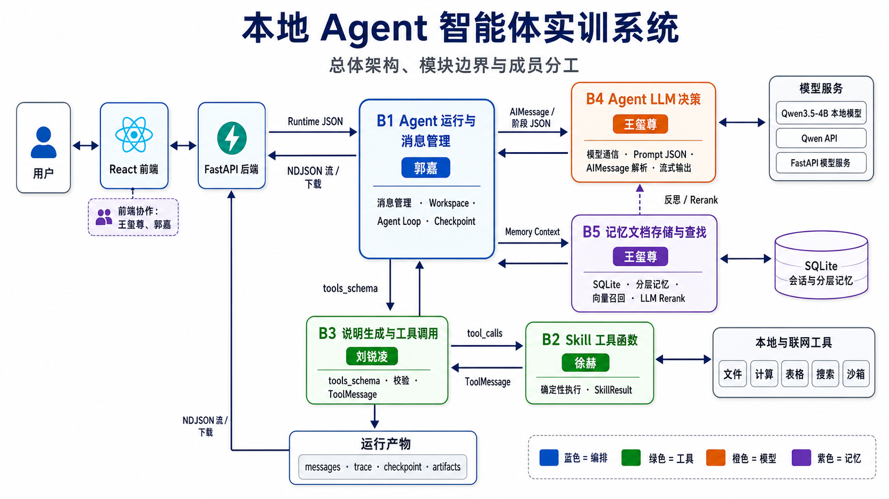
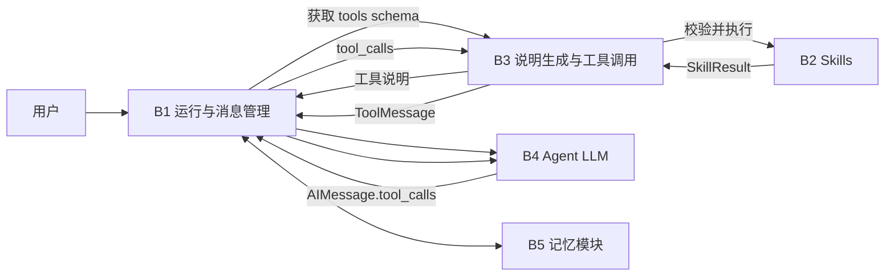

# 综合实训Ⅱ阶段 - 个人结题技术报告

> **报告人：刘锐凌**  
> **学号：20236543**  
> **负责模块：B3 说明生成与工具调用模块**

---

## 一、项目与团队基本信息

- **项目名称**：本地 Agent 智能体实训系统
- **项目方向**：B 方向——Agent 智能体实践
- **代码审计基线**：`main` 分支 `d1156b1`
- **系统目标**：完成 B1–B5 五个模块的基础功能，并集成为 React + FastAPI Web 系统，使智能体能够完成模型决策、工具调用、文件处理、记忆管理和结果展示。

### 成员最终分工与交付核对表

| 角色 | 姓名 | 学号 | 主要负责模块 |
|---|---|---:|---|
| 组长 | 王玺尊 | 20236481 | B4 Agent LLM、B5 记忆模块、前端协作 |
| 组员 | 郭嘉 | 20236529 | B1 Agent 运行与消息管理、前端协作 |
| **组员** | **刘锐凌** | **20236543** | **B3 说明生成与工具调用模块** |
| 组员 | 徐赫 | 20236513 | B2 Skill 工具函数模块 |

项目采用同一 GitHub 仓库持续集成，各模块通过统一的 JSON 消息协议协作。本人重点负责 B3 模块的工具说明生成、工具调用校验、B2 Skill 调用和 ToolMessage 封装，并参与系统联调与文档整理。最终代码经过团队共同合并和优化，因此本报告不把协作代码表述为个人独占成果。

---

## 二、整体系统架构与最终成果展示

### 2.1 最终系统总体架构图



*图 2-1 系统总体架构与成员分工。B3 位于 B4 模型决策层和 B2 Skill 执行层之间。*

系统以 B1 为运行中心：B1 组织会话和 Agent 循环，B4 根据消息和工具说明生成普通回答或 `tool_calls`，B3 对工具请求进行校验并调用 B2，B5 保存和召回长期会话信息。各模块职责独立，通过标准数据结构连接。

### 2.2 系统整体运行流程与集成说明

一次包含工具调用的完整流程如下：

1. 用户在前端输入任务，后端将请求交给 B1；
2. B1 从 B3 获取当前工具集合对应的 `tools_schema`；
3. B4 根据用户问题和工具说明生成 `AIMessage`；
4. 当 `AIMessage` 包含 `tool_calls` 时，B1 将其交给 B3；
5. B3 校验工具名称、调用编号和参数，再调用 B2 Skill；
6. B3 将 B2 的 `SkillResult` 包装为标准 `ToolMessage`；
7. B1 把 ToolMessage 交回 B4，由 B4 根据真实工具结果生成最终回答；
8. 对话和工具步骤由 B5 保存，结果通过前端展示。



### 2.3 最终产品展示（Demo）


*图 2-2 系统主对话界面。系统能够执行文件读取、内容处理和文件生成，并向用户提供产物下载入口。*


*图 2-3 B3 真实运行观察界面。页面展示了 AIMessage、B3 解析与校验、B2 SkillResult、ToolMessage 和 15 个真实 tools schema；同轮调用中成功项和错误项均被保留。*

### 2.4 团队系统代码库

- **团队仓库**：[https://github.com/aaaprprpr/agent](https://github.com/aaaprprpr/agent)
- **项目说明**：[README.md](README.md)

---

## 三、个人核心模块技术报告（个人成绩核心依据）

### 3.1 模块定位与系统融合方式

B3 是 B4 与 B2 之间的工具协议层。它不负责理解完整用户意图，也不决定智能体下一步动作，而是负责把工具配置转换为模型可读的说明，并把模型给出的工具请求安全地转交给 B2。

模块主要包含两项职责：

1. **说明生成**：读取 `configs/tools.yaml` 和指定 toolset，生成 OpenAI-style tools schema，使 B4 知道工具名称、用途、参数和返回值；
2. **工具调用**：接收一个或多个 `tool_calls`，检查工具是否注册、参数是否完整及类型是否正确，调用 B2 后生成 ToolMessage。

| 接口方向 | 输入 | B3 处理 | 输出 |
|---|---|---|---|
| B1 → B3 | 工具配置、toolset | 读取配置并生成 schema | `tools_schema` |
| B4/B1 → B3 | `AIMessage.tool_calls` | 规范化、校验、调用 B2 | `ToolMessage[]` |
| B3 → B2 | 工具名和参数 | 动态加载并执行 Skill | `SkillResult` |
| B3 → 文件系统 | schema 与调用记录 | 保存 JSON/JSONL 产物 | 日志、统计和缓存 |

B3 的重要作用是隔离模型输出的不确定性。即使模型请求了未知工具、漏写必填参数，B3 也会生成结构化的错误 ToolMessage，而不是让整个 Agent 直接崩溃。

### 3.2 核心技术实现路径

#### 3.2.1 工具说明生成

`get_tools_schema()` 读取 `configs/tools.yaml` 中的工具集合，并生成标准函数工具说明。每个工具包含：

- 工具名称和用途；
- 参数 JSON Schema；
- 必填字段和基础类型；
- `x-returns` 业务返回结构；
- `x-skill-result` 统一执行结果说明。

当前实现还会通过 `inspect.signature()` 读取 Python 函数签名，在 YAML 缺少简单参数时进行补充。业务描述仍以 YAML 为准，因此这属于“YAML + 函数签名”的联合生成，而不是完全自动生成。

#### 3.2.2 工具调用、校验与错误处理

`execute_tool_calls()` 依次处理模型给出的工具请求。以下代码对当前实现进行了适度简化，以突出校验、执行和消息封装三项核心步骤：

```python
for index, raw_call in enumerate(tool_calls):
    call = normalize_tool_call(raw_call, index)
    name = call["name"]
    args = call["args"]

    if name not in allowed_tools:
        result = _error_result(
            name, args,
            ValueError(f"tool is not available: {name}"),
        )
    else:
        definition, _ = _tool_with_inferred_schema(
            get_tool_definition(config, name)
        )
        _validate_args(args, definition)
        output = _run_configured_tool(...)
        result = make_skill_result(
            name, "success", args, output, None, latency_ms
        )

    message = make_tool_message(
        call["id"], call["name"],
        json.dumps(result, ensure_ascii=False),
        result["status"],
    )
```

实际代码还包含异常捕获、有限重试、缓存、artifact 下载地址和调用统计。无论执行成功还是失败，每个 tool call 都保留原始调用编号，以保证 B1 和 B4 能正确对应结果。

#### 3.2.3 进阶功能

| 功能 | 实现方式 | 当前边界 |
|---|---|---|
| 多 tool_calls | 按原顺序逐项校验和执行，返回多个 ToolMessage | 暂未并行执行 |
| 有限重试 | 只重试配置中的可恢复异常 | 有副作用工具强制只执行一次 |
| 结果缓存 | 对配置允许的只读工具使用稳定缓存键 | 缓存主要在当前输出目录内生效 |
| 调用统计 | 统计成功、失败、缓存命中和平均耗时 | 尚未形成跨模型批量评测 |
| Artifact 传递 | 校验生成文件相对路径并补充下载地址 | 下载端仍需再次进行路径校验 |

这些功能提高了模块的可靠性，但 B3 不会替模型选择工具，也不会修改工具的业务结果。

### 3.3 最终结果与性能评估

#### 3.3.1 验证方法

仓库提供了正常与异常输入样例，包括：

- `ai_message_with_tool_calls.json`：正常工具请求；
- `b3_tool_call_missing_required.json`：缺少必填参数；
- `b3_tool_call_unknown_tool.json`：未知工具；
- `b3_tool_call_file_writer_valid.json`：文件生成；
- `b3_tool_call_file_writer_invalid_path.json`：非法路径；
- `b3_tool_call_file_reader_docx.json`：Office 文件读取；
- `b3_tool_call_web_search.json`：联网工具调用。

模块既可以通过命令行独立执行，也可以在浏览器 B3 演示页中运行真实后端接口。

#### 3.3.2 已保存的运行结果

最新保存的 B3 演示产物位于：

`outputs/backend_runs/b3_demo/20260715_141958_044952/`

| 检查项 | 实际结果 |
|---|---:|
| `basic_tools` 工具数量 | 15 |
| 本次 calculator 调用数 | 1 |
| 成功 / 失败 | 1 / 0 |
| 输入表达式 | `((18 + 24) * 3 - 16) / 5 + 2 ** 3` |
| 计算结果 | 30.0 |
| 当次工具耗时 | 0.408 ms |

该结果由 `tool_schema_report.json`、`tool_messages.json` 和 `tool_stats.json` 共同记录。图 2-3 还展示了集成链路中的三次 tool call：成功结果和参数错误均能转成 ToolMessage，单项失败不会抹去同轮其他工具的执行记录。

上述耗时只代表一次本地 calculator 调用，不应外推为所有工具的性能。网页搜索、文件读取和模型服务会受到网络、文件大小和运行环境影响。

#### 3.3.3 课程要求完成度

| B3 要求 | 完成情况 |
|---|---|
| 读取 tools.yaml 和 toolset | 已完成 |
| 生成模型可识别的工具说明 | 已完成 |
| 校验工具名称和必填参数 | 已完成 |
| 调用 B2 Skill | 已完成 |
| 封装标准 ToolMessage | 已完成 |
| 保存 schema、调用日志和统计 | 已完成 |
| 多 tool_calls、重试和缓存 | 已实现基础版本 |
| 不同 schema 描述准确率对照 | 尚未完成批量实验 |

### 3.4 个人交付物清单

- **B3 核心源码**：[code/b3_tool_layer.py](https://github.com/aaaprprpr/agent/blob/main/code/b3_tool_layer.py)
- **工具配置**：[configs/tools.yaml](https://github.com/aaaprprpr/agent/blob/main/configs/tools.yaml)
- **B3 前端页面**：[frontend/src/B3ModuleView.tsx](https://github.com/aaaprprpr/agent/blob/main/frontend/src/B3ModuleView.tsx)
- **B3 演示服务**：[backend/tool_demo_service.py](https://github.com/aaaprprpr/agent/blob/main/backend/tool_demo_service.py)
- **个人模块说明**：[刘锐凌PERSONAL_README.md](https://github.com/aaaprprpr/agent/blob/main/%E5%88%98%E9%94%90%E5%87%8CPERSONAL_README.md)
- **团队集成仓库**：[https://github.com/aaaprprpr/agent](https://github.com/aaaprprpr/agent)

模板要求填写“个人独立仓库链接”，目前仅能确认团队仓库中的 B3 模块直链。如果验收教师要求每人单独建立仓库，需要由本人补充独立仓库 URL。

---

## 四、实训总结与心得体会

### 4.1 个人实训收获与挑战

#### 遇到的主要挑战

B3 的难点是同时面对模型输出的不稳定性和工具执行的确定性要求。模型可能请求不存在的工具、遗漏参数或传入错误类型；如果直接调用函数，错误会扩散到整个 Agent。文件生成等带副作用工具还不能随意重试，否则可能重复写入文件。

#### 解决方法

我将处理过程拆分为“说明生成—请求规范化—参数校验—Skill 执行—结果封装”五个阶段，并保留每次调用的 id、输入、状态、错误和耗时。未知工具和参数错误被转成 ToolMessage，带副作用工具限制为单次执行，只读工具可以使用缓存。通过 B1、B2、B4 的联合调试，最终形成了完整的工具调用闭环。

#### 心得体会

本次实训让我认识到，智能体并不是只要接入大模型就能稳定运行。模型负责判断语义和提出工具请求，程序仍然需要保证工具范围、参数格式、执行安全和错误可追踪。清晰的模块边界和统一的数据结构能够显著降低多人协作中的联调成本。

当前 B3 已满足课程基础要求，并实现了重试、缓存、统计和多工具调用等增强能力。后续仍可增加标准 JSON Schema 深层校验、无副作用工具并行执行以及 schema 描述效果的批量对照实验，使模块的评测更加完整。
