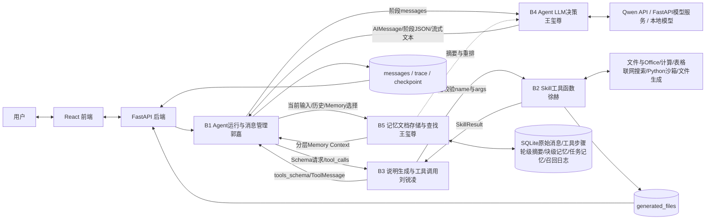

# 综合实训Ⅱ阶段 - 个人结题技术报告

---

## 一、 项目与团队基本信息

*   **本人姓名**：[刘锐凌]
*   **本人学号**：[20236543]
*   **项目名称**：[B方向 Agent 智能体]
*   **实际完成目标**：[完成 B1-B5 五模块基础要求并形成 React + FastAPI Web 主链路；包含多轮工具循环、流式输出、文件上传与产物下载、Checkpoint 中断恢复、会话级 System Prompt 热更新、工具缓存与统计、基于 DDGS/DuckDuckGo 的联网搜索、带超时与输出限制的 Python 沙箱、SQLite 分层记忆、轮级/块级压缩、关键词与向量召回、LLM 重排等进阶功能]
*   **小组其他成员**：[王玺尊、郭嘉、徐赫]

### 成员最终分工与交付核对表

|   角色   |       姓名       |     学号     |                 实际负责的核心模块名称                  |              个人代码库链接              |
| :------: | :--------------: | :----------: | :-----------------------------------------------------: | :--------------------------------------: |
|   组长   |      王玺尊      |   20236481   | 模块B4、B5（Agent LLM决策模块、记忆文档存储与查找模块） |   [https://github.com/aaaprprpr/agent]   |
|   组员   |       郭嘉       |   20236529   |            模块B1（Agent运行与消息管理模块）           |   [https://github.com/aaaprprpr/agent]   |
| **组员** |    **刘锐凌**    | **20236543** |          **模块B3（说明生成与工具调用模块）**           | **[https://github.com/SYuPg/agent]** |
|   组员   |       徐赫       |   20236513   |               模块B2（Skill工具函数模块）              |   [https://github.com/aaaprprpr/agent]   |

---


## 二、整体系统架构与最终成果展示

### 2.1 最终系统总体架构图



当前系统由交互层、接口层、五个核心模块、模型服务和持久化资源共同组成，各部分职责如下：

| 组成部分               | 当前实现与团队成果                                                                                                                                                           |
| ---------------------- | ---------------------------------------------------------------------------------------------------------------------------------------------------------------------------- |
| React 前端             | 提供多轮对话、文件上传、流式回答、工具过程折叠区、产物下载、历史会话、回答终止/恢复、会话提示词编辑，以及 B1-B5 独立观察/演示页面。                                          |
| FastAPI 后端           | 提供对话与 SSE 接口、上传文件管理、会话查询/删除、System Prompt 更新、生成文件受限下载、取消/恢复，以及五模块演示 API；不承载核心 Agent 决策。                               |
| B1 Agent运行与消息管理 | 接收 Runtime 输入，组织标准消息和 Workspace，协调 B5、B3、B4，推进 Planning、Tool Calling、Observation、Answering，维护流式事件和 Checkpoint。                               |
| B2 Skill工具函数       | 提供独立、JSON可序列化的实际执行能力，包括文件/目录浏览、TXT/Markdown/Office读取、文件搜索、计算、当前时间、CSV/XLSX表格分析、DDGS联网搜索、多格式文件生成和受限Python沙箱。 |
| B3 说明生成与工具调用  | 从 `tools.yaml` 生成 OpenAI风格 Schema，检查工具名与必填参数，动态调用 B2并封装 ToolMessage；同时负责可恢复重试、结果缓存、调用日志、耗时统计和文件产物引用。                |
| B4 Agent LLM决策       | 读取 `model.yaml`，统一支持本地 Transformers、远端 FastAPI和 Qwen API代理；提供普通生成、流式生成和结构化 JSON生成，将原始模型输出解析为标准 AIMessage并保存调用产物。       |
| B5 记忆文档存储与查找  | 以 SQLite为当前主要实现，保存原始会话和工具步骤，生成轮级摘要、块级记忆和任务记忆；结合字段/关键词评分、向量召回与 LLM重排，为 B1构造带来源信息的 Memory Context。           |
| 模型与数据资源         | Qwen模型服务负责语言生成，Embedding接口服务于 B5向量召回；SQLite保存会话与分层记忆，`outputs/backend_runs/`保存模型、工具、Trace和生成文件等可核验产物。                     |

五个模块通过 JSON 数据协议协作，但仍保留各自的 CLI入口和独立演示能力。课程初始的 CLI 与 Markdown Memory 链路作为基础验收兼容入口保留，当前正式产品以 React + FastAPI + SQLite 的 Web 链路为主。

### 2.2 系统整体运行流程与集成说明

当前系统以一次用户输入为一个独立任务，完整 Web 运行过程如下：

1. **前端交互与后端资源准备**：React提交文本和附件，并立即创建等待状态。FastAPI保存上传文件、读取会话历史和会话级 System Prompt，生成包含 `conversation_id`、历史消息、文件引用、Toolset和记忆选项的 Runtime输入。回答期间，后端将 B1事件转换为 SSE；取消、恢复和文件下载也通过独立接口处理。
2. **B5构造本轮记忆上下文**：B5以当前输入作为查询，读取 SQLite中的原始消息与工具步骤，并结合近期历史、轮级摘要、块级记忆和任务记忆构造候选。系统可使用关键词/字段相关性、时间因素和向量相似度筛选，再通过 LLM重排，最终向 B1返回近期原文、召回内容和来源标识。摘要用于压缩和定位，精确事实仍可追溯到原始消息或工具步骤。
3. **B3发现并描述可用能力**：B3读取 `configs/tools.yaml`中当前 Toolset，根据配置和 Python函数签名生成 `tools_schema`。Schema包含工具名、说明、参数、必填字段和返回结构，使 B4能够在不知道 Skill内部代码的情况下选择工具。B3把 Schema返回 B1，并在运行目录保存可检查的 Schema报告。
4. **B1组织状态，B4完成模型决策**：B1建立 Workspace并按阶段选择输入。B4读取 `configs/model.yaml`，根据配置连接 Qwen API代理、远端 FastAPI服务或本地 Transformers模型，保存实际 Prompt和原始输出，再解析为 Planning/Observation JSON或标准 `AIMessage`。B4不执行工具，也不直接写入记忆。
5. **B3校验调用，B2执行 Skill**：当 AIMessage包含一个或多个 `tool_calls`时，B3检查工具是否属于当前 Toolset、参数是否完整，再动态调用 B2。B2只负责执行具体能力并返回统一 SkillResult：文件与Office读取、目录浏览、文件搜索、数学计算、当前时间、表格分析、DDGS联网搜索、多格式文件写入和受限Python沙箱均遵循同一结构。B3随后附加调用ID、状态、错误、耗时、缓存与Artifact信息，封装为 ToolMessage返回 B1。
6. **观察、重规划与最终回答**：B1把 ToolMessage写入标准消息链和 Workspace，B4在 Observation阶段判断结果是否真正满足用户目标，而不是只判断工具进程是否成功。有效信息、失败结果和仍缺信息被分别记录；必要时再次调用 B3/B2，证据充分后进入 Answering。最终回答使用 B4流式接口逐步返回，文件下载地址不混入正文，而由后端和前端以独立卡片展示。
7. **结果持久化与记忆更新**：后端将用户消息、AI回答和工具步骤写入 SQLite；B1保存 `messages.json`、`trace.json`、`final_answer.md`和 Checkpoint，B2/B3保存工具日志、统计与生成文件，B4保存原始输出和标准 AIMessage。任务完成后，B5在后台生成或更新轮级摘要、任务记忆和块级记忆，使后续对话能够召回本轮事实与产物。
8. **观察与独立验收**：前端为 B1-B5分别提供观察和演示页面。B1展示状态与 Workspace，B2支持选择 Skill并手工执行，B3展示 Schema和 ToolMessage封装，B4展示模型输入、原始输出与标准协议，B5展示原始历史、压缩结果、召回过程和最终 Memory Context。各页面读取旁路数据或调用模块公开接口，不改变主对话运行逻辑。

团队集成采用“固定协议、独立实现”的方式。Runtime、AIMessage、ToolMessage、SkillResult、tools_schema和 Memory Context构成模块边界；配置文件分别由 `model.yaml`、`tools.yaml`和 `memory.yaml`管理。这样既保证完整 Agent链路可运行，也使每位成员负责的模块能够脱离前端单独测试和验收。

### 2.3 最终产品展示 (Demo)


以下为系统核心功能与各模块运行界面的完整截图：

**1. 主对话界面**
展示多轮对话、流式回答、历史会话及文件上传/下载等核心交互功能。


**2. B1-B5 模块观察界面**
各模块观察页展示内部运行状态：B1 展示 Workspace 与状态机，B2 展示 Skill 手工执行，B3 展示工具协议与调用日志，B4 展示模型输入与输出解析，B5 展示分层记忆与召回过程。

| B1 观察界面 | B2 观察界面 | B3 观察界面 |
| :---: | :---: | :---: |
|  |  |  |

| B4 观察界面 | B5 观察界面 |
| :---: | :---: |
|  |  |

**3. B1-B5 模块演示界面**
各模块演示页展示独立功能调用与结果反馈，便于脱离主链路进行模块级验收。

| B1 演示界面 | B2 演示界面 | B3 演示界面 |
| :---: | :---: | :---: |
|  |  |  |

| B4 演示界面 | B5 演示界面 |
| :---: | :---: |
|  |  |

当前系统支持普通多轮问答、本地文件读取与总结、目录与文件搜索、表格分析、数学计算、当前时间、联网搜索、多种文件生成、轻量 Python 沙箱执行、回答中断恢复、历史会话读取及会话 System Prompt 编辑。


### 2.4 团队系统代码库
*   **团队 Github/Gitee 开源仓库链接**：[https://github.com/aaaprprpr/agent]

---


## 三、个人核心模块技术报告（个人成绩核心依据）

### 3.1 模块定位与系统融合方式

B3 是 B4 与 B2 之间的工具协议层。它不负责理解完整用户意图，也不决定智能体下一步动作，而是负责把工具配置转换为模型可读的说明，并把模型给出的工具请求安全地转交给 B2。

模块主要包含两项职责：

1. **说明生成**：读取 `configs/tools.yaml` 和指定 toolset，生成 OpenAI-style tools schema，使 B4 知道工具名称、用途、参数和返回值；
2. **工具调用**：接收一个或多个 `tool_calls`，检查工具是否注册、参数是否完整及类型是否正确，调用 B2 后生成 ToolMessage。

| 接口方向 | 输入 | B3 处理 | 输出 |
|---|---|---|---|
| B1 → B3 | 工具配置、toolset | 读取配置并生成 schema | `tools_schema` |
| B4/B1 → B3 | `AIMessage.tool_calls` | 规范化、校验、调用 B2 | `ToolMessage[]` |
| B3 → B2 | 工具名和参数 | 动态加载并执行 Skill | `SkillResult` |
| B3 → 文件系统 | schema 与调用记录 | 保存 JSON/JSONL 产物 | 日志、统计和缓存 |

B3 的重要作用是隔离模型输出的不确定性。即使模型请求了未知工具、漏写必填参数，B3 也会生成结构化的错误 ToolMessage，而不是让整个 Agent 直接崩溃。

### 3.2 核心技术实现路径

#### 3.2.1 工具说明生成

`get_tools_schema()` 读取 `configs/tools.yaml` 中的工具集合，并生成标准函数工具说明。每个工具包含：

- 工具名称和用途；
- 参数 JSON Schema；
- 必填字段和基础类型；
- `x-returns` 业务返回结构；
- `x-skill-result` 统一执行结果说明。

当前实现还会通过 `inspect.signature()` 读取 Python 函数签名，在 YAML 缺少简单参数时进行补充。业务描述仍以 YAML 为准，因此这属于“YAML + 函数签名”的联合生成，而不是完全自动生成。

#### 3.2.2 工具调用、校验与错误处理

`execute_tool_calls()` 依次处理模型给出的工具请求。以下代码对当前实现进行了适度简化，以突出校验、执行和消息封装三项核心步骤：

```python
for index, raw_call in enumerate(tool_calls):
    call = normalize_tool_call(raw_call, index)
    name = call["name"]
    args = call["args"]

    if name not in allowed_tools:
        result = _error_result(
            name, args,
            ValueError(f"tool is not available: {name}"),
        )
    else:
        definition, _ = _tool_with_inferred_schema(
            get_tool_definition(config, name)
        )
        _validate_args(args, definition)
        output = _run_configured_tool(...)
        result = make_skill_result(
            name, "success", args, output, None, latency_ms
        )

    message = make_tool_message(
        call["id"], call["name"],
        json.dumps(result, ensure_ascii=False),
        result["status"],
    )
```

实际代码还包含异常捕获、有限重试、缓存、artifact 下载地址和调用统计。无论执行成功还是失败，每个 tool call 都保留原始调用编号，以保证 B1 和 B4 能正确对应结果。

#### 3.2.3 进阶功能

| 功能 | 实现方式 | 当前边界 |
|---|---|---|
| 多 tool_calls | 按原顺序逐项校验和执行，返回多个 ToolMessage | 暂未并行执行 |
| 有限重试 | 只重试配置中的可恢复异常 | 有副作用工具强制只执行一次 |
| 结果缓存 | 对配置允许的只读工具使用稳定缓存键 | 缓存主要在当前输出目录内生效 |
| 调用统计 | 统计成功、失败、缓存命中和平均耗时 | 尚未形成跨模型批量评测 |
| Artifact 传递 | 校验生成文件相对路径并补充下载地址 | 下载端仍需再次进行路径校验 |

这些功能提高了模块的可靠性，但 B3 不会替模型选择工具，也不会修改工具的业务结果。

### 3.3 最终结果与性能评估

#### 3.3.1 验证方法

仓库提供了正常与异常输入样例，包括：

- `ai_message_with_tool_calls.json`：正常工具请求；
- `b3_tool_call_missing_required.json`：缺少必填参数；
- `b3_tool_call_unknown_tool.json`：未知工具；
- `b3_tool_call_file_writer_valid.json`：文件生成；
- `b3_tool_call_file_writer_invalid_path.json`：非法路径；
- `b3_tool_call_file_reader_docx.json`：Office 文件读取；
- `b3_tool_call_web_search.json`：联网工具调用。

模块既可以通过命令行独立执行，也可以在浏览器 B3 演示页中运行真实后端接口。

#### 3.3.2 已保存的运行结果

最新保存的 B3 演示产物位于：

`outputs/backend_runs/b3_demo/20260715_141958_044952/`

| 检查项 | 实际结果 |
|---|---:|
| `basic_tools` 工具数量 | 15 |
| 本次 calculator 调用数 | 1 |
| 成功 / 失败 | 1 / 0 |
| 输入表达式 | `((18 + 24) * 3 - 16) / 5 + 2 ** 3` |
| 计算结果 | 30.0 |
| 当次工具耗时 | 0.408 ms |

该结果由 `tool_schema_report.json`、`tool_messages.json` 和 `tool_stats.json` 共同记录。图 2-3 还展示了集成链路中的三次 tool call：成功结果和参数错误均能转成 ToolMessage，单项失败不会抹去同轮其他工具的执行记录。

上述耗时只代表一次本地 calculator 调用，不应外推为所有工具的性能。网页搜索、文件读取和模型服务会受到网络、文件大小和运行环境影响。

#### 3.3.3 课程要求完成度

| B3 要求 | 完成情况 |
|---|---|
| 读取 tools.yaml 和 toolset | 已完成 |
| 生成模型可识别的工具说明 | 已完成 |
| 校验工具名称和必填参数 | 已完成 |
| 调用 B2 Skill | 已完成 |
| 封装标准 ToolMessage | 已完成 |
| 保存 schema、调用日志和统计 | 已完成 |
| 多 tool_calls、重试和缓存 | 已实现基础版本 |
| 不同 schema 描述准确率对照 | 尚未完成批量实验 |


### 3.4 个人交付物清单

*   **个人模块源码仓库**：[https://github.com/SYuPg/agent]

    个人模块主要交付物如下：

    - `b3_tool_layer.py]`：B3 核心源码。
    - `configs/tools.yaml`：工具配置。
    - `frontend/src/B3ModuleView.tsx`：B3 前端页面。
    - `backend/tool_demo_service.py`：B3 演示服务。
    - `刘锐凌PERSONAL_README.md`：个人模块说明。

---

## 四、实训总结与心得体会

### 4.1 个人实训收获与挑战

#### 遇到的主要挑战

作为 B3 模块的负责人，最大的挑战在于 如何平衡“灵活的能力发现”与“严格的执行安全”。一方面，Agent 需要能够自由调用各种工具，要求 B3 能够动态生成 Schema 并容忍 LLM 可能产生的各种调用意图（包括参数格式偏差、调用不存在的工具等）；另一方面，真实系统必须保证文件操作、Python 沙箱等能力的边界安全，避免越权访问或恶意注入。

在开发初期，B3 仅能处理简单调用，缺乏对参数类型的校验、重试机制和缓存。当 B1 和 B4 逐步接入后，发现 LLM 经常生成缺少必填参数或类型不匹配的调用，导致 B2 函数抛出难以理解的异常，前端只看到“工具执行失败”而无具体原因。同时，联网搜索等外部 API 偶尔超时，但整个对话链因此中断，用户体验很差。

此外，团队联调时还出现过 B3 与 B2 之间 data_root 路径不一致的问题：B2 读取文件时使用相对路径，而 B3 传递的是绝对路径，导致文件找不到；以及生成文件的下载 URL 在会话间无法复用，前端下载时 404 等问题。

#### 解决方法

建立严格的输入校验层：在 B3 内部引入完整的参数校验逻辑（_validate_args），并在 tool_calls 不规范时提前返回清晰的错误信息，而不是透传到 B2 再崩溃。错误信息包含缺失参数名或类型错误描述，使 B4 的 Observation 阶段能够理解失败原因并调整策略。

引入重试与缓存：参考可靠系统设计模式，为可恢复错误实现重试，为无副作用的工具实现缓存。通过 tools.yaml 配置灵活控制哪些工具可重试、哪些可缓存，既提高了可靠性，又减少了重复耗时。

统一路径与上下文注入：与 B2 负责人沟通后，约定所有文件操作工具都接收 data_root、allowed_roots 等注入参数，B3 统一从配置中解析并注入。同时，生成文件必须写入 output_dir/generated_files/ 下，并返回 relative_output_path，由 B3 统一生成下载 URL。这样路径问题被彻底解决。

#### 心得体会

本次实训让我认识到，智能体并不是只要接入大模型就能稳定运行。模型负责判断语义和提出工具请求，程序仍然需要保证工具范围、参数格式、执行安全和错误可追踪。清晰的模块边界和统一的数据结构能够显著降低多人协作中的联调成本。

当前 B3 已满足课程基础要求，并实现了重试、缓存、统计和多工具调用等增强能力。后续仍可增加标准 JSON Schema 深层校验、无副作用工具并行执行以及 schema 描述效果的批量对照实验，使模块的评测更加完整。
