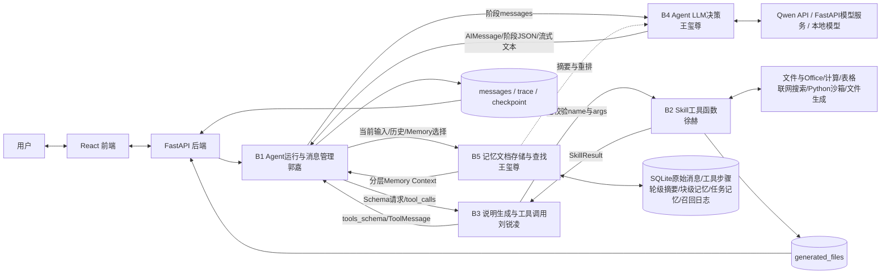
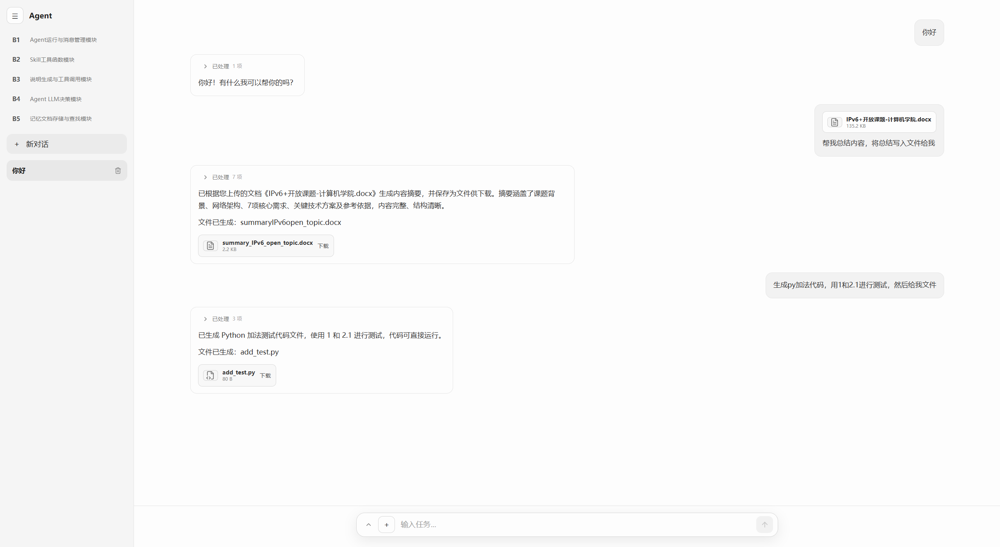
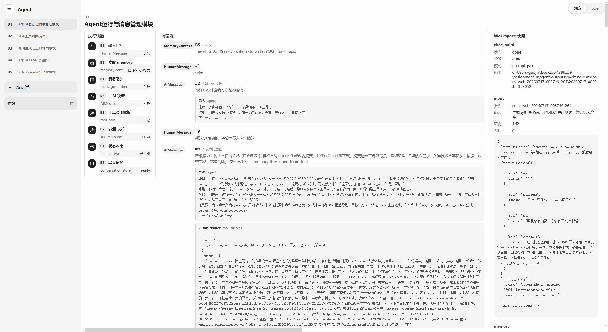
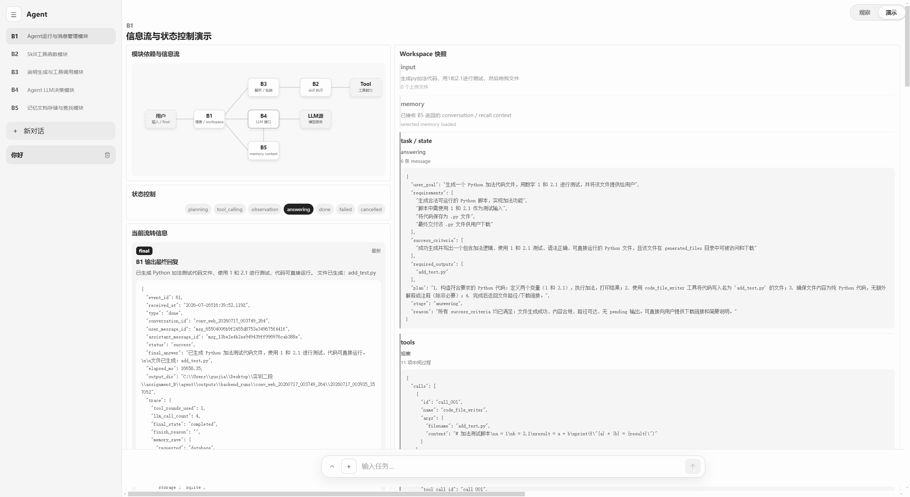
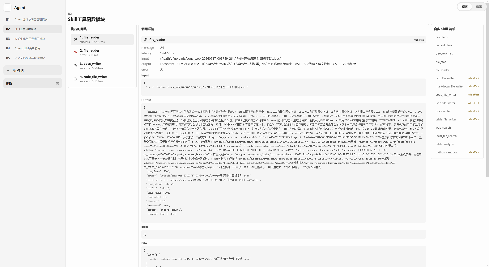
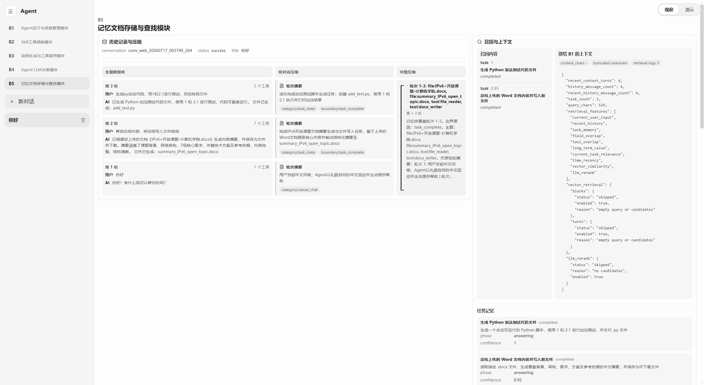
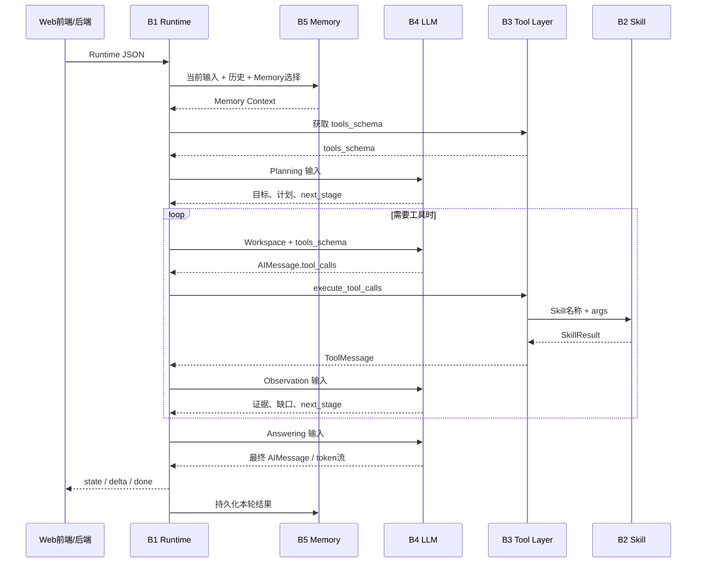
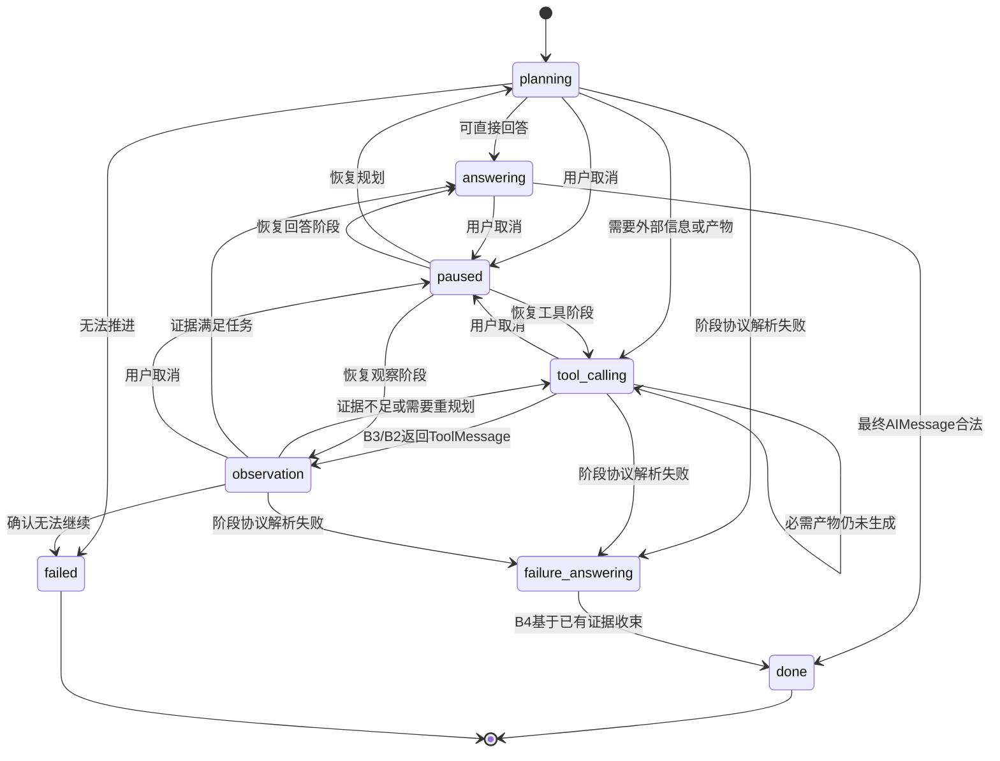

# 综合实训Ⅱ阶段 - 个人结题技术报告


---

## 一、 项目与团队基本信息

*   **本人姓名**：[郭嘉]
*   **本人学号**：[20236529]
*   **项目名称**：[B方向 Agent 智能体]
*   **实际完成目标**：[完成 B1-B5 五模块基础要求并形成 React + FastAPI Web 主链路；包含多轮工具循环、流式输出、文件上传与产物下载、Checkpoint 中断恢复、会话级 System Prompt 热更新、工具缓存与统计、基于 DDGS/DuckDuckGo 的联网搜索、带超时与输出限制的 Python 沙箱、SQLite 分层记忆、轮级/块级压缩、关键词与向量召回、LLM 重排等进阶功能]
*   **小组其他成员**：[王玺尊、刘锐凌、徐赫]

### 成员最终分工与交付核对表

|   角色   |       姓名       |     学号     |                 实际负责的核心模块名称                  |              个人代码库链接              |
| :------: | :--------------: | :----------: | :-----------------------------------------------------: | :--------------------------------------: |
|   组长   |      王玺尊      |   20236481   | 模块B4、B5（Agent LLM决策模块、记忆文档存储与查找模块） |   [https://github.com/aaaprprpr/agent]   |
| **组员** | **郭嘉（本人）** | **20236529** |          **模块B1（Agent运行与消息管理模块）**          | **[https://github.com/aaaprprpr/agent]** |
|   组员   |      刘锐凌      |   20236543   |            模块B3（说明生成与工具调用模块）             |   [https://github.com/aaaprprpr/agent]   |
|   组员   |       徐赫       |   202x...    |               模块B2（Skill工具函数模块）               |   [https://github.com/aaaprprpr/agent]   |
---

## 二、 整体系统架构与最终成果展示

### 2.1 最终系统总体架构图




当前系统由交互层、接口层、五个核心模块、模型服务和持久化资源共同组成，各部分职责如下：

| 组成部分               | 当前实现与团队成果                                                                                                                                                           |
| ---------------------- | ---------------------------------------------------------------------------------------------------------------------------------------------------------------------------- |
| React 前端             | 提供多轮对话、文件上传、流式回答、工具过程折叠区、产物下载、历史会话、回答终止/恢复、会话提示词编辑，以及 B1-B5 独立观察/演示页面。                                          |
| FastAPI 后端           | 提供对话与 SSE 接口、上传文件管理、会话查询/删除、System Prompt 更新、生成文件受限下载、取消/恢复，以及五模块演示 API；不承载核心 Agent 决策。                               |
| B1 Agent运行与消息管理 | 接收 Runtime 输入，组织标准消息和 Workspace，协调 B5、B3、B4，推进 Planning、Tool Calling、Observation、Answering，维护流式事件和 Checkpoint。                               |
| B2 Skill工具函数       | 提供独立、JSON可序列化的实际执行能力，包括文件/目录浏览、TXT/Markdown/Office读取、文件搜索、计算、当前时间、CSV/XLSX表格分析、DDGS联网搜索、多格式文件生成和受限Python沙箱。 |
| B3 说明生成与工具调用  | 从 `tools.yaml` 生成 OpenAI风格 Schema，检查工具名与必填参数，动态调用 B2并封装 ToolMessage；同时负责可恢复重试、结果缓存、调用日志、耗时统计和文件产物引用。                |
| B4 Agent LLM决策       | 读取 `model.yaml`，统一支持本地 Transformers、远端 FastAPI和 Qwen API代理；提供普通生成、流式生成和结构化 JSON生成，将原始模型输出解析为标准 AIMessage并保存调用产物。       |
| B5 记忆文档存储与查找  | 以 SQLite为当前主要实现，保存原始会话和工具步骤，生成轮级摘要、块级记忆和任务记忆；结合字段/关键词评分、向量召回与 LLM重排，为 B1构造带来源信息的 Memory Context。           |
| 模型与数据资源         | Qwen模型服务负责语言生成，Embedding接口服务于 B5向量召回；SQLite保存会话与分层记忆，`outputs/backend_runs/`保存模型、工具、Trace和生成文件等可核验产物。                     |

五个模块通过 JSON 数据协议协作，但仍保留各自的 CLI入口和独立演示能力。课程初始的 CLI 与 Markdown Memory 链路作为基础验收兼容入口保留，当前正式产品以 React + FastAPI + SQLite 的 Web 链路为主。

### 2.2 系统整体运行流程与集成说明

当前系统以一次用户输入为一个独立任务，完整 Web 运行过程如下：

1. **前端交互与后端资源准备**：React提交文本和附件，并立即创建等待状态。FastAPI保存上传文件、读取会话历史和会话级 System Prompt，生成包含 `conversation_id`、历史消息、文件引用、Toolset和记忆选项的 Runtime输入。回答期间，后端将 B1事件转换为 SSE；取消、恢复和文件下载也通过独立接口处理。
2. **B5构造本轮记忆上下文**：B5以当前输入作为查询，读取 SQLite中的原始消息与工具步骤，并结合近期历史、轮级摘要、块级记忆和任务记忆构造候选。系统可使用关键词/字段相关性、时间因素和向量相似度筛选，再通过 LLM重排，最终向 B1返回近期原文、召回内容和来源标识。摘要用于压缩和定位，精确事实仍可追溯到原始消息或工具步骤。
3. **B3发现并描述可用能力**：B3读取 `configs/tools.yaml`中当前 Toolset，根据配置和 Python函数签名生成 `tools_schema`。Schema包含工具名、说明、参数、必填字段和返回结构，使 B4能够在不知道 Skill内部代码的情况下选择工具。B3把 Schema返回 B1，并在运行目录保存可检查的 Schema报告。
4. **B1组织状态，B4完成模型决策**：B1建立 Workspace并按阶段选择输入。B4读取 `configs/model.yaml`，根据配置连接 Qwen API代理、远端 FastAPI服务或本地 Transformers模型，保存实际 Prompt和原始输出，再解析为 Planning/Observation JSON或标准 `AIMessage`。B4不执行工具，也不直接写入记忆。
5. **B3校验调用，B2执行 Skill**：当 AIMessage包含一个或多个 `tool_calls`时，B3检查工具是否属于当前 Toolset、参数是否完整，再动态调用 B2。B2只负责执行具体能力并返回统一 SkillResult：文件与Office读取、目录浏览、文件搜索、数学计算、当前时间、表格分析、DDGS联网搜索、多格式文件写入和受限Python沙箱均遵循同一结构。B3随后附加调用ID、状态、错误、耗时、缓存与Artifact信息，封装为 ToolMessage返回 B1。
6. **观察、重规划与最终回答**：B1把 ToolMessage写入标准消息链和 Workspace，B4在 Observation阶段判断结果是否真正满足用户目标，而不是只判断工具进程是否成功。有效信息、失败结果和仍缺信息被分别记录；必要时再次调用 B3/B2，证据充分后进入 Answering。最终回答使用 B4流式接口逐步返回，文件下载地址不混入正文，而由后端和前端以独立卡片展示。
7. **结果持久化与记忆更新**：后端将用户消息、AI回答和工具步骤写入 SQLite；B1保存 `messages.json`、`trace.json`、`final_answer.md`和 Checkpoint，B2/B3保存工具日志、统计与生成文件，B4保存原始输出和标准 AIMessage。任务完成后，B5在后台生成或更新轮级摘要、任务记忆和块级记忆，使后续对话能够召回本轮事实与产物。
8. **观察与独立验收**：前端为 B1-B5分别提供观察和演示页面。B1展示状态与 Workspace，B2支持选择 Skill并手工执行，B3展示 Schema和 ToolMessage封装，B4展示模型输入、原始输出与标准协议，B5展示原始历史、压缩结果、召回过程和最终 Memory Context。各页面读取旁路数据或调用模块公开接口，不改变主对话运行逻辑。

团队集成采用“固定协议、独立实现”的方式。Runtime、AIMessage、ToolMessage、SkillResult、tools_schema和 Memory Context构成模块边界；配置文件分别由 `model.yaml`、`tools.yaml`和 `memory.yaml`管理。这样既保证完整 Agent链路可运行，也使每位成员负责的模块能够脱离前端单独测试和验收。

### 2.3 最终产品展示 (Demo)





| B1模块观察界面                               | B1模块演示界面                               |
| -------------------------------------------- | -------------------------------------------- |
|  |  |

| B2模块观察界面                               | B2模块演示界面                               |
| -------------------------------------------- | -------------------------------------------- |
|  |  |

| B3模块观察界面                               | B3模块演示界面                               |
| -------------------------------------------- | -------------------------------------------- |
|  |  |

| B4模块观察界面                               | B4模块演示界面                               |
| -------------------------------------------- | -------------------------------------------- |
|  |  |

| B5模块观察界面                               | B5模块演示界面                               |
| -------------------------------------------- | -------------------------------------------- |
|  |  |

当前系统支持普通多轮问答、本地文件读取与总结、目录与文件搜索、表格分析、数学计算、当前时间、联网搜索、多种文件生成、轻量 Python 沙箱执行、回答中断恢复、历史会话读取及会话 System Prompt 编辑。


### 2.4 团队系统代码库
*   **团队 Github/Gitee 开源仓库链接**：[https://github.com/aaaprprpr/agent]

---

## 三、 个人核心模块技术报告


### 3.1 模块定位与系统融合方式
*   **在系统中的角色**

    我负责的 B1“Agent运行与消息管理模块”是五模块系统的运行时控制中心。它不直接推理、不实现具体 Skill，也不操作记忆数据库，而是接收一次用户任务，统一管理 SystemMessage、HumanMessage、AIMessage 和 ToolMessage，维护本轮 Workspace 和状态机，并在正确时机调用 B5、B3 和 B4。
    B1 的核心价值是控制信息披露与状态移动：不同阶段只向模型发送完成当前决策所需的数据，工具原始协议不会无差别污染最终回答，B5内部数据库细节也不会泄漏到工具层。B1还统一提供同步、流式、取消与恢复入口，使 CLI 基础验收链路和 Web 产品链路共享同一套核心逻辑。

*   **上下游依赖与接口协同**

    B1 对外暴露 `run()`、`run_stream()` 和 `resume_stream()` 三个入口。上游是 CLI 或 FastAPI 后端，输入为 Runtime JSON，核心字段包括 `conversation_id`、`user_input`、`history_messages`、`input_images`、`system_prompt`、`selected_memory_ids`、`toolset`、`max_turns` 和 `save_memory`。

    | 协作节点     | B1 发送的数据                                                | B1 接收的数据                                                                        | 交互时机                                                |
    | ------------ | ------------------------------------------------------------ | ------------------------------------------------------------------------------------ | ------------------------------------------------------- |
    | B5           | 会话 ID、当前用户输入、历史消息、所选 Memory、模型配置       | `selected_memory`、近期历史、轮级/块级/任务记忆和召回后的 `workspace_memory_context` | Planning 之前准备上下文；成功结束后保存本轮消息和 Trace |
    | B3           | `tools_config`、`toolset`；模型生成的一个或多个 `tool_calls` | OpenAI 风格 `tools_schema`；按调用 ID 对齐的 `ToolMessage` 列表                      | 任务初始化时发现工具；Tool Calling 阶段执行工具         |
    | B4           | 当前阶段的标准 messages、Workspace 摘要、必要的 tools schema | Planning/Observation JSON，或标准 `AIMessage`                                        | Planning、Tool Calling、Observation、Answering 各阶段   |
    | FastAPI/前端 | 流式状态、工具开始/结束、文本增量、完成/取消结果             | 用户输入、附件、停止和恢复请求                                                       | 整轮任务运行期间                                        |



### 3.2 核心技术实现路径

#### 算法与工程实现

B1 将一次用户输入视为一个独立任务，创建结构化 Workspace 作为本轮工作内存。Workspace 包含：

| 区域     | 主要内容                                                                   | 使用方式                                |
| -------- | -------------------------------------------------------------------------- | --------------------------------------- |
| `input`  | 当前问题、近期历史、图片数量（当前未实现识图功能，后续添加）、历史选择策略 | Planning 和最终回答的任务边界           |
| `memory` | B5返回的显式 Memory 与分层召回上下文                                       | Planning理解背景，Answering补充长期事实 |
| `task`   | 用户目标、要求、成功条件、必要产物、计划、当前阶段                         | 控制状态转移和阶段 Prompt               |
| `tools`  | 调用、结果、观察、有效/无效证据、最近工具意图                              | 重规划、证据筛选和最终回答              |
| `draft`  | 已知事实和缺失信息                                                         | 判断继续工具还是收束回答                |
| `final`  | 最终答案与状态                                                             | 返回前端和持久化                        |
| `trace`  | 各阶段结构化快照                                                           | 调试、验收观察和断点恢复                |

Prompt 被拆分为默认 Agent System Prompt 与 B1 阶段提示词，统一存放在 `prompts/agent_system_prompts.json` 和 `prompts/b1_stage_prompts.json`。Planning 只看到任务、记忆和工具简表；Tool Calling 才披露完整 Schema；Observation 重点读取最新 ToolMessage 与任务成功条件；Answering 只保留用户目标、可靠证据、缺口和产物状态。这样减少无关上下文，也防止模型把工具调用请求误当作事实。

状态机如下：



语义判断主要交给 B4：模型在 Planning 和 Observation 返回 `next_stage`。B1只保留协议级保护，包括工具调用后必须观察、要求文件但尚无成功产物时不能声称完成、阶段 JSON 解析失败时由模型根据已有证据生成说明、达到 `max_turns` 时终止异常循环，以及取消时保存 Checkpoint。

#### 关键代码逻辑

以下代码均从当前 B1源码中提取，只保留决定信息流和状态的关键语句，省略函数包装、路径处理、日志记录和异常分支。

##### 1. 运行前完成跨模块资源装配

B1先以当前输入调用 B5准备记忆，再从 B3取得工具 Schema。模型、工具和数据库的内部实现均不会进入 B1：

```python
selected_memory = load_memory(
    str(memory_file),
    runtime["selected_memory_ids"],
    runtime["use_global_memory"],
    runtime["user_input"],
    str(output_dir),
)
tools_schema = get_tools_schema(str(tools_file), runtime["toolset"], str(output_dir))
runtime, _ = _prepare_workspace_runtime_context(
    runtime, memory_file, selected_memory, output_dir, model_file, mode
)
```

##### 2. 用标准消息和 Workspace建立本轮任务边界

当前输入不会直接拼接成一整段字符串，而是与 SystemMessage、近期历史保持明确角色；工具结果在后续阶段以 ToolMessage继续追加：

```python
workspace = _workspace_from_runtime(runtime, selected_memory)
current_user_message = {"role": "user", "content": runtime["user_input"]}
messages = [
    {"role": "system", "content": system_prompt},
    *workspace["input"]["history_messages"],
    current_user_message,
]
```

##### 3. Planning结果直接形成可执行状态

模型返回的目标、成功条件、必要产物和下一状态被写入 Workspace。后续阶段读取的是这些结构化状态，而不是反复猜测原始用户文本：

```python
plan = plan_result["json"]
workspace["task"].update({
    "user_goal": str(plan.get("user_goal") or runtime["user_input"]),
    "requirements": _as_string_list(plan.get("requirements")),
    "success_criteria": _as_string_list(plan.get("success_criteria")),
    "required_outputs": plan.get("required_outputs") if isinstance(plan.get("required_outputs"), list) else [],
    "plan": str(plan.get("plan") or ""),
    "stage": str(plan.get("next_stage") or "answering"),
    "reason": str(plan.get("reason") or ""),
})
next_stage = workspace["task"]["stage"]
```

##### 4. Tool Calling与Observation组成真正的循环

这部分是 B1最核心的控制骨架：B4只产生调用意图，B3执行工具；执行结果同时进入标准消息链和 Workspace，随后由 Observation决定下一状态：

```python
while next_stage == "tool_calling":
    tool_prompt = _workspace_tool_messages(system_prompt, workspace, tools_schema)
    ai_message = generate_ai_message(..., tool_prompt, ...)["ai_message"]
    tool_calls = ai_message.get("tool_calls", [])
    tool_messages = execute_tool_calls(
        tool_calls, str(tools_file), runtime["toolset"], str(output_dir)
    )

    messages.extend([ai_message, *tool_messages])
    workspace["tools"]["calls"].extend(deepcopy(tool_calls))
    workspace["tools"]["results"].extend(deepcopy(tool_messages))

    observation_prompt = _workspace_observation_messages(
        system_prompt, workspace, tool_messages
    )
    observation = generate_json_object(..., observation_prompt, ...)["json"]

    _merge_unique(workspace["tools"]["accepted_evidence"], observation.get("accepted_evidence"))
    _merge_unique(workspace["tools"]["rejected_evidence"], observation.get("rejected_evidence"))
    _merge_unique(workspace["draft"]["known_facts"], observation.get("known_facts"))
    _merge_unique(workspace["draft"]["missing_info"], observation.get("missing_info"))
    next_stage = _apply_observation_next_stage(workspace, observation)
```

##### 5. Checkpoint保存恢复所需的最小完整状态

断点不是只保存最终文本，而是保存恢复控制流所需的 Runtime、标准消息、Workspace、调用计数和当前阶段。恢复时以 `stage`为入口继续执行：

```python
save_checkpoint(runtime["conversation_id"], {
    "status": status,
    "stage": stage,
    "partial_answer": partial_answer,
    "runtime": deepcopy(runtime),
    "messages": deepcopy(messages),
    "all_tool_messages": deepcopy(all_tool_messages),
    "tool_rounds": tool_rounds,
    "llm_calls": llm_calls,
    "turns": deepcopy(turns),
    "workspace": deepcopy(workspace),
})

checkpoint = load_checkpoint(conversation_id)
workspace = deepcopy(checkpoint["workspace"])
messages = deepcopy(checkpoint["messages"])
next_stage = str(checkpoint.get("stage") or workspace["task"]["stage"])
```

#### 进阶挑战攻克

- **ReAct状态控制**：主循环由 `planning`、`tool_calling`、`observation`、`answering`及终止状态组成。B4判断 `next_stage`，B1负责执行转移；证据不足可重新调用工具，任务满足后才进入最终回答。
- **Workspace工作内存**：每轮输入创建独立Workspace，用 `input`、`memory`、`task`、`tools`、`draft`、`final`和 `trace`持续保存任务目标、证据、缺口与阶段结果。各阶段只读取当前决策所需区域，避免历史工具请求和无关内容污染上下文。
- **Prompt统一管理**：系统提示词、阶段提示词和会话提示词分别保存在 `prompts/`下的JSON文件中，由 `b1_prompting.py`按状态加载。完整工具Schema仅在Tool Calling阶段注入；会话Prompt以 `conversation_id`保存副本，修改后下一轮热更新生效。
- **多轮与记忆上下文**：每轮Planning前，B1按当前用户输入调用B5，接收近期消息、轮级摘要、块级记忆和任务记忆；单次任务支持多次Tool Calling/Observation循环及单轮多个 `tool_calls`。
- **流式与断点恢复**：`run_stream()`输出状态、工具事件和文本增量；关键阶段将messages、Workspace、调用计数和下一状态写入Checkpoint，`resume_stream()`从未完成阶段继续，避免重复执行已完成工具。

### 3.3 最终结果与性能评估
*   **测试与验证**
    B1属于运行控制模块，评价重点是消息协议是否正确、状态是否按预期推进、工具结果是否进入下一轮、异常能否收束以及中断后能否恢复。我采用以下方式验证：

    | 验证方式         | 输入或入口                                                   | 主要检查内容                                                            |
    | ---------------- | ------------------------------------------------------------ | ----------------------------------------------------------------------- |
    | Fixture 独立验证 | `data/b1_fixtures/b1_fixture_input.json`                     | 不依赖真实模型，检查 System/Human/AI/ToolMessage 顺序和至少一次工具闭环 |
    | CLI 集成验证     | `data/runtime_input.json` + `code/run_full_demo.py`          | 检查 B5→B1→B4→B3/B2→B4 完整链路及输出文件                               |
    | Web 人工任务集   | `acceptance_questions.txt`                                   | 检查多轮对话、文件工具、多次工具循环、错误收束、记忆召回和生成文件下载  |
    | 中断恢复验证     | 前端停止按钮与“恢复”操作                                     | 检查取消即时反馈、Checkpoint阶段、部分回答和恢复后的后续工具/LLM执行    |
    | 协议与产物检查   | `messages.json`、`trace.json`、`final_answer.md`、Checkpoint | 检查状态、调用计数、Workspace证据、最终回答和运行错误是否一致           |

*   **结果分析**

    | B1模块观察界面                               | B1模块演示界面                               |
    | -------------------------------------------- | -------------------------------------------- |
    |  |  |

    从当前实现和已有运行产物看，B1已达到基础验收目标：能够接收问题、在模型调用前取得 B5 Memory 和 B3 Schema、维护四类标准消息、执行至少一次完整工具闭环，并通过 `max_turns=10`限制异常循环。在此基础上，Web主链路已经能够显示 Planning、Tool Calling、Observation 和 Answering 的中间过程，最终回答采用流式输出，取消后可保留 Checkpoint 并恢复。

    | 指标          | 当前结果                       | 证据位置                                                     |
    | ------------- | ------------------------------ | ------------------------------------------------------------ |
    | 标准消息链    | 已实现                         | `outputs/backend_runs/<conversation>/<run>/messages.json`    |
    | 多轮工具闭环  | 已实现                         | `trace.json` 中的 `turns`、`tool_rounds` 和 Workspace Trace  |
    | Memory 注入   | 已实现                         | `selected_memory.json`、`workspace_memory_context.json`      |
    | 流式回答      | 已实现                         | FastAPI SSE 与前端逐字显示                                   |
    | 中断与恢复    | 已实现阶段级 Checkpoint/Resume | `checkpoints/<conversation_id>.json`、恢复接口和前端恢复按钮 |
    | 会话级 Prompt | 已实现                         | `prompts/conversation_prompts.json` 与对应 FastAPI 接口      |
    

### 3.4 个人交付物清单
*   **个人模块源码仓库**：[https://github.com/aaaprprpr/agent]

    个人模块主要交付物如下：

    - `code/b1_agent_runtime.py`：B1统一入口和运行模式装配。
    - `code/b1_agent_runtime_parts/b1_workspace_loop.py`：Workspace状态机、同步/流式循环、取消和恢复。
    - `code/b1_agent_runtime_parts/b1_workspace.py`：Workspace创建、证据整理和必要产物检查。
    - `code/b1_agent_runtime_parts/b1_prompting.py`：阶段提示词加载与输入选择。
    - `code/b1_agent_runtime_parts/b1_checkpoint.py`：按会话保存和读取 Checkpoint。
    - `code/b1_agent_runtime_parts/b1_runtime_input.py`、`b1_llm_bridge.py`、`b1_fixture.py`：输入校验、B4桥接和独立验收数据。
    - `prompts/agent_system_prompts.json`、`prompts/b1_stage_prompts.json`：默认系统提示词与阶段协议。
    - `frontend/src/B1ModuleView.tsx` 及对应后端旁路接口：B1观察与演示页面。
    - `郭嘉PERSONAL_README.md`：个人模块完整使用、设计与验收说明。

---

## 四、 实训总结与心得体会

### 4.1 个人实训收获与挑战
*   **遇到的最大挑战**

    最大挑战是把最初一次“LLM→Tool→LLM”的简单循环，扩展为可维护、可恢复、能够处理真实长任务的运行控制模块。早期实现把历史消息、工具请求、工具结果和最终回答混在同一段 Prompt 中，模型容易重复上轮工具、把失败结果当作事实，或者在文件尚未生成时直接宣布完成。多人同步代码后还出现过字段缺失、函数移动后引用失效、固定错误回答掩盖真实原因等联调问题。

*   **如何克服的**

    我首先重新明确 B1-B5 的接口边界，借鉴其消息角色和 Agent循环思想建立统一的 System/Human/AI/ToolMessage 协议。随后把 B1拆分为 Runtime输入、Workspace、Prompting、LLM桥接、Checkpoint 和 Loop 等子模块；引入 Planning、Tool Calling、Observation、Answering 状态，将语义判断交给 B4，B1只保留必要的协议保护。对于长对话，B1不直接读取数据库，而是在 Planning前通过 B5接口获取压缩与召回上下文；对于中断，采用阶段级 Checkpoint记录完整 Workspace和消息状态。联调时通过 `trace.json`、B4原始输出、B3 ToolMessage和前端旁路观察逐层定位，而不是只看最终回答猜测错误位置。

*   **心得体会**

    Agent工程的难点不只是“让模型会调用工具”，而是让每一类信息有明确身份、让每个模块只承担自己的职责，并为失败、恢复和调试保留证据。Prompt不能替代程序协议，程序规则也不应代替模型完成语义判断；更合理的方式是由模型判断目标、证据和下一步，由代码保证消息格式、产物真实性和模块边界。

    AI工具显著改变了开发过程。它能够承担大量重复编码、接口样板、资料整理和初步排错工作，使开发者把更多精力放在需求拆分、架构设计和系统验证上。但这并不意味着开发者只需要描述一个结果，就能得到可靠的软件。只有理解业务细节、技术术语、模块关系和失败边界，才能向AI提供准确约束，并判断生成结果是否真的符合工程要求。缺少这些基础时，AI很容易生成“局部看起来正确、整体无法维护”的代码，面向结果反复补丁最终只会积累更多耦合和隐患。我认为AI不会简单取代程序员，而是会提高对程序员的要求：机械编码的重要性下降，问题建模、接口设计、代码审查、调试和验收能力变得更加重要。开发者仍然需要对最终结果负责，AI更适合作为扩大个人执行能力的工具。

    在工程能力上，我完成了从单文件脚本到多模块、前后端、流式接口和持久化状态的整理，进一步理解了接口设计、状态机、SSE、断点恢复和可观察性。在团队协作方面，我也认识到稳定的数据协议、清晰的模块所有权和合并后的回归检查，比单纯增加功能更重要。
