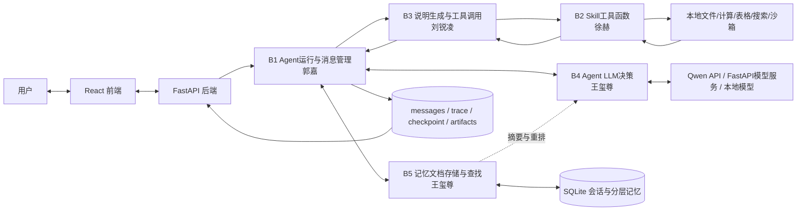
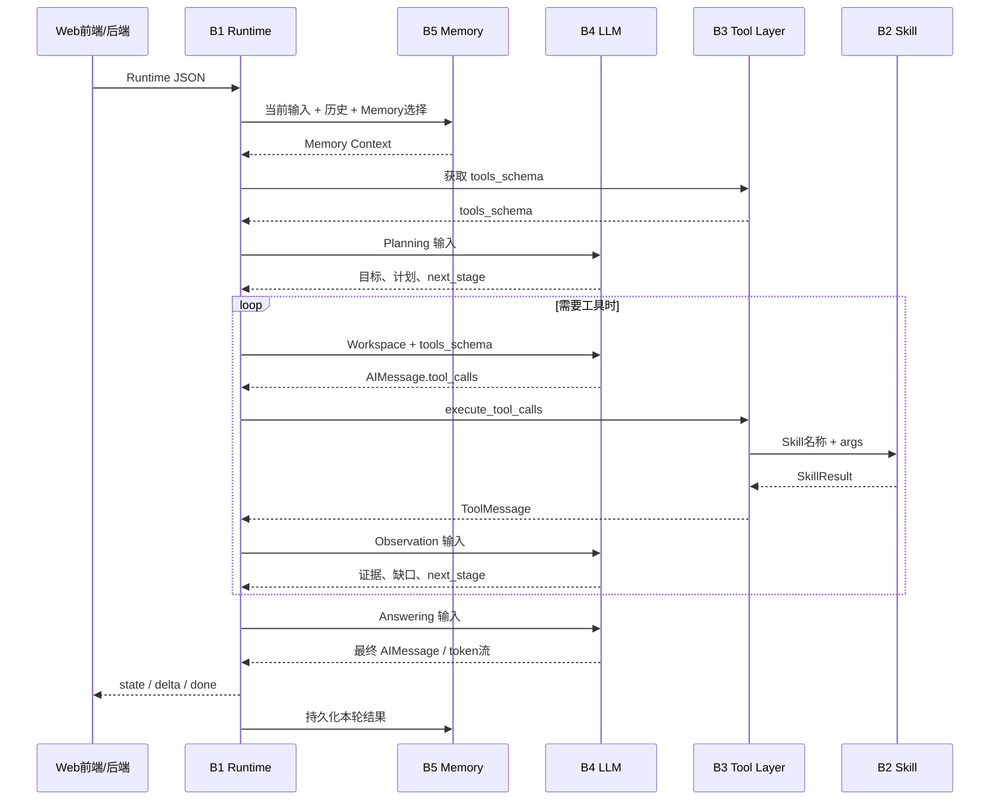
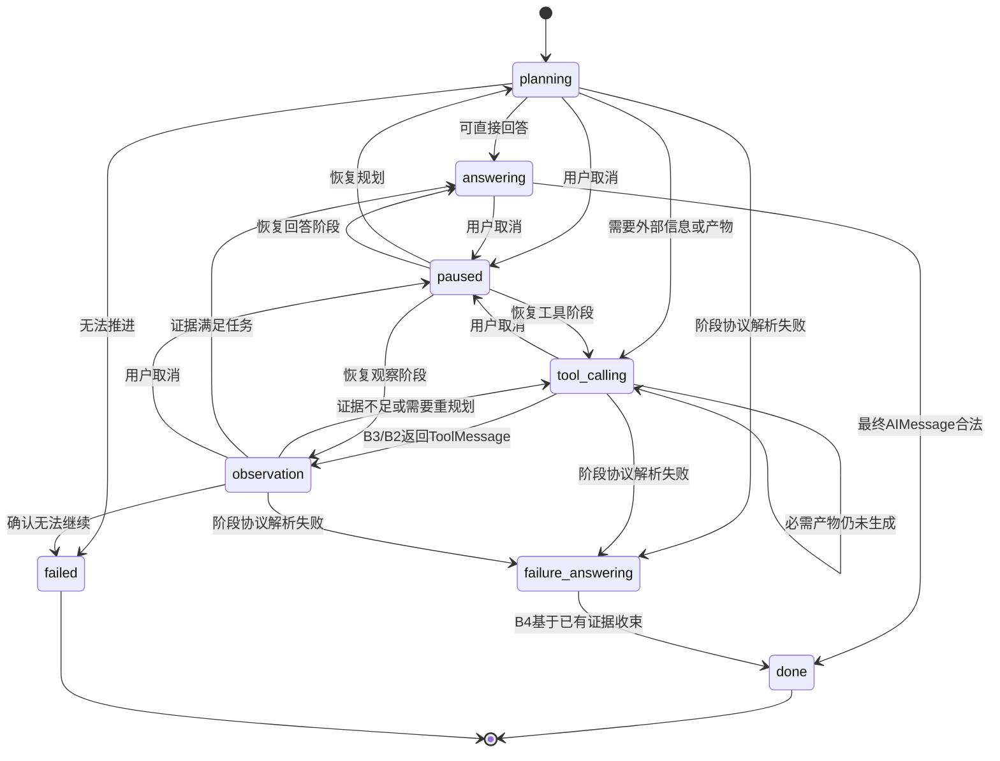

# 综合实训Ⅱ阶段 - 个人结题技术报告

> **撰写与提交要求（提交前请删除本提示说明）：**
> 1. 本报告为**个人结题报告**，每位组员均需独立提交一份。
> 2. 报告需使用 Markdown 格式编写，排版需清晰整洁。
> 3. 报告中必须附带真实的 **个人模块源码仓库链接** 与 **团队完整合并代码库链接**。
> 4. 第二部分（系统整体架构）小组内可以复用相同内容，但第三部分（个人核心模块）必须由本人独立撰写。

---

## 一、 项目与团队基本信息

*   **本人姓名**：[郭嘉]
*   **本人学号**：[20236529]
*   **项目名称**：[B方向 Agent 智能体]
*   **实际完成目标**：[完成 B1-B5 五模块基础要求并形成 React + FastAPI Web 主链路；包含多轮工具循环、流式输出、文件上传与产物下载、Checkpoint 中断恢复、会话级 System Prompt 热更新、工具缓存与统计、SQLite 分层记忆、轮级/块级压缩、关键词与向量召回、LLM 重排等进阶功能]
*   **小组其他成员**：[王玺尊、刘锐凌、徐赫]

### 成员最终分工与交付核对表
> *请在下表中加粗本人所在行，以便验收老师快速定位。*

|   角色   |       姓名       |     学号     |                 实际负责的核心模块名称                  | 个人代码库链接 |
| :------: | :--------------: | :----------: | :-----------------------------------------------------: | :------------: |
|   组长   |      王玺尊      |   202x...    | 模块B4、B5（Agent LLM决策模块、记忆文档存储与查找模块） |     [Link]     |
| **组员** | **郭嘉（本人）** | **20236529** |          **模块B1（Agent运行与消息管理模块）**          |   **[Link]**   |
|   组员   |      刘锐凌      |   202x...    |            模块B3（说明生成与工具调用模块）             |     [Link]     |
|   组员   |       徐赫       |   202x...    |               模块B2（Skill工具函数模块）               |     [Link]     |
---

## 二、 整体系统架构与最终成果展示

### 2.1 最终系统总体架构图
（请插入一张最终实现的系统架构图，必须清晰标明各个成员负责的独立模块在系统中的物理位置与数据流向。）
`[插入系统架构图图片]`



该图以当前 Web 主链路为准。B1 是运行时编排中心，只通过固定 JSON 协议协调 B2-B5；FastAPI 负责 HTTP/SSE 接口与会话资源管理，React 前端负责对话和五模块观察/演示。课程初始的 CLI 与 Markdown Memory 链路仍作为兼容验收入口保留，但不作为当前产品的主要运行方式。

### 2.2 系统整体运行流程与集成说明
> **[填写样例]**：
> 用户在前端界面输入问题后，请求通过 FastAPI 发送至**[模块A：路由管控]**。模块A判断该问题是否需要外部知识：
> 1. 若需要，则调用**[模块B（李四负责）：RAG检索]**，将返回的 Top-3 文本片段组装成 Context。
> 2. 若涉及天气、计算等特定任务，则触发**[模块C（张三负责）：Skill增强]**调用外部 API 获取结果。
> 最终，所有上下文由模块A拼接进入 Prompt 交给 LLaMA-3 模型生成回复，并返回给用户端。在模块合并时，我们主要遇到了前后端跨域（CORS）问题以及模块A与模块B之间 JSON 数据字段不一致的坑，最终通过统一定义 Pydantic 数据模型解决。

当前系统的一次 Web 对话按以下顺序运行：

1. 用户在 React 前端输入问题并可附加文件。FastAPI 保存上传文件，读取该会话的历史消息与 System Prompt，组装标准 Runtime 输入交给 B1。
2. B1 在任务规划前调用 B5。B5 根据当前 `conversation_id`、用户本轮输入、历史消息和用户选择的 Memory，返回近期原始消息、轮级摘要、块级记忆、任务记忆及召回结果；B1只接收已经整理好的 Memory Context，不进入 B5 内部实现。
3. B1 调用 B3 读取 `configs/tools.yaml` 并获得当前 `tools_schema`，随后把当前阶段所需的 System Prompt、Memory、用户输入和结构化 Workspace 交给 B4。
4. B4 经 `configs/model.yaml` 选择模型源，将模型原始输出解析为标准 `AIMessage`。如果包含 `tool_calls`，B1 将其交给 B3；B3校验工具名和参数后调用 B2 Skill，并把执行结果封装成 `ToolMessage` 返回。
5. B1 将工具结果写入 Workspace，调用 B4 完成 Observation。模型判断证据是否足够、是否需要重规划或继续调用工具；流程可以执行多轮 `LLM → Tool → Observation → LLM`，最终进入 Answering。
6. 最终回答通过 SSE 增量返回前端；运行结束后，消息、工具步骤、Trace、文件产物和记忆写入 SQLite 与 `outputs/backend_runs/`。用户中断时，B1在阶段边界保存 Checkpoint，恢复时从保存的状态继续执行。

集成过程中最关键的问题不是单一接口能否调用，而是五个模块必须保持独立验收边界。项目最终统一了 Runtime、AIMessage、ToolMessage、SkillResult 和 Memory Context 等结构，并将模型决策、工具执行、记忆持久化与前端接口分别留在对应模块，避免 B1 直接实现工具或记忆逻辑。

### 2.3 最终产品展示 (Demo)
（提供 2-3 张整个系统成功运行的关键截图，或提供演示视频的链接。截图需能体现系统的核心功能。）
`[插入系统运行截图/GIF]`

建议保留以下最终运行证据：

- `[插入截图：主对话页面，展示流式回答、已处理区域和历史会话]`
- `[插入截图：文件上传、工具调用过程及生成文件下载卡片]`
- `[插入截图：B1-B5 观察/演示页面，展示 Workspace、工具协议、模型解析和分层记忆]`

当前 Demo 支持普通多轮问答、本地文件读取与总结、目录与文件搜索、表格分析、数学计算、当前时间、联网搜索、多种文件生成、轻量 Python 沙箱执行、回答中断恢复、历史会话读取及会话 System Prompt 编辑。

### 2.4 团队系统代码库
*   **团队 Github/Gitee 开源仓库链接**：[Link]
> *注：该仓库的 README 中需有整体项目的详细说明。*

---

## 三、 个人核心模块技术报告（个人成绩给定的核心依据）

> **注意**：本部分**仅需填写你本人负责的模块**，切勿将其他组员的工作写在此处。内容越详实、逻辑越清晰，个人得分越高。

### 3.1 模块定位与系统融合方式
*   **在系统中的角色**：本模块在宏观架构中承担了什么不可替代的作用？
    > **[填写样例]**：我负责的 RAG 知识库检索模块（模块B）是整个客服系统的“大脑知识库”。没有本模块，系统将受限于大模型本身的幻觉，无法回答公司内部文档的专业问题。

    我负责的 B1“Agent运行与消息管理模块”是五模块系统的运行时控制中心。它不直接推理、不实现具体 Skill，也不操作记忆数据库，而是接收一次用户任务，统一管理 SystemMessage、HumanMessage、AIMessage 和 ToolMessage，维护本轮 Workspace 和状态机，并在正确时机调用 B5、B3 和 B4。没有 B1，各模块只能独立演示，无法形成“读取记忆—模型规划—工具执行—结果观察—最终回答—记忆持久化”的完整闭环。

    B1 的核心价值是控制信息披露与状态移动：不同阶段只向模型发送完成当前决策所需的数据，工具原始协议不会无差别污染最终回答，B5内部数据库细节也不会泄漏到工具层。B1还统一提供同步、流式、取消与恢复入口，使 CLI 基础验收链路和 Web 产品链路共享同一套核心逻辑。

*   **上下游依赖与接口协同**：本模块是如何与其他同学的模块连通的？（详细列出接收了谁的数据、数据格式是什么；处理完后，以什么接口或格式传给了谁。）
    > **[填写样例]**：本模块作为微服务独立部署。上游接收【模块A】发来的 HTTP POST 请求，数据格式为 `{"query": "如何请假", "top_k": 3}`；内部经过 BGE 模型向量化及 Milvus 数据库检索后，下游以 JSON 格式 `{"status": 200, "context": ["请假流程...", "病假规定..."]}` 返回给【模块A】进行融合。

    B1 对外暴露 `run()`、`run_stream()` 和 `resume_stream()` 三个入口。上游是 CLI 或 FastAPI 后端，输入为 Runtime JSON，核心字段包括 `conversation_id`、`user_input`、`history_messages`、`input_images`、`system_prompt`、`selected_memory_ids`、`toolset`、`max_turns` 和 `save_memory`。

    | 协作节点 | B1 发送的数据 | B1 接收的数据 | 交互时机 |
    |---|---|---|---|
    | B5 | 会话 ID、当前用户输入、历史消息、所选 Memory、模型配置 | `selected_memory`、近期历史、轮级/块级/任务记忆和召回后的 `workspace_memory_context` | Planning 之前准备上下文；成功结束后保存本轮消息和 Trace |
    | B3 | `tools_config`、`toolset`；模型生成的一个或多个 `tool_calls` | OpenAI 风格 `tools_schema`；按调用 ID 对齐的 `ToolMessage` 列表 | 任务初始化时发现工具；Tool Calling 阶段执行工具 |
    | B4 | 当前阶段的标准 messages、Workspace 摘要、必要的 tools schema | Planning/Observation JSON，或标准 `AIMessage` | Planning、Tool Calling、Observation、Answering 各阶段 |
    | FastAPI/前端 | 流式状态、工具开始/结束、文本增量、完成/取消结果 | 用户输入、附件、停止和恢复请求 | 整轮任务运行期间 |



### 3.2 核心技术实现路径
*   **算法与工程实现**：详细说明该模块底层是如何写出来的。使用了什么大模型版本？什么提示词（Prompt）工程？哪些开源框架或核心算法？
    > **[填写样例]**：本模块使用 LangChain 框架搭建。文档切分采用了 RecursiveCharacterTextSplitter（chunk_size=500）；向量化采用了开源的 BGE-m3 模型；存储采用本地 ChromaDB。

    B1 使用原生 Python 数据结构实现，没有引入 LangChain Agent。当前默认模型是 B4 通过本地代理调用的 `qwen-plus`，同时保留 Qwen3.5-4B 本地 Transformers 与远端 FastAPI 模式；模型切换属于 B4职责，B1只依赖稳定的生成接口。

    B1 将一次用户输入视为一个独立任务，创建结构化 Workspace 作为本轮工作内存。Workspace 包含：

    | 区域 | 主要内容 | 使用方式 |
    |---|---|---|
    | `input` | 当前问题、近期历史、图片数量、历史选择策略 | Planning 和最终回答的任务边界 |
    | `memory` | B5返回的显式 Memory 与分层召回上下文 | Planning理解背景，Answering补充长期事实 |
    | `task` | 用户目标、要求、成功条件、必要产物、计划、当前阶段 | 控制状态转移和阶段 Prompt |
    | `tools` | 调用、结果、观察、有效/无效证据、最近工具意图 | 重规划、证据筛选和最终回答 |
    | `draft` | 已知事实和缺失信息 | 判断继续工具还是收束回答 |
    | `final` | 最终答案与状态 | 返回前端和持久化 |
    | `trace` | 各阶段结构化快照 | 调试、验收观察和断点恢复 |

    Prompt 被拆分为默认 Agent System Prompt 与 B1 阶段提示词，统一存放在 `prompts/agent_system_prompts.json` 和 `prompts/b1_stage_prompts.json`。Planning 只看到任务、记忆和工具简表；Tool Calling 才披露完整 Schema；Observation 重点读取最新 ToolMessage 与任务成功条件；Answering 只保留用户目标、可靠证据、缺口和产物状态。这样减少无关上下文，也防止模型把工具调用请求误当作事实。

    状态机如下：



    语义判断主要交给 B4：模型在 Planning 和 Observation 返回 `next_stage`。B1只保留协议级保护，包括工具调用后必须观察、要求文件但尚无成功产物时不能声称完成、阶段 JSON 解析失败时由模型根据已有证据生成说明、达到 `max_turns` 时终止异常循环，以及取消时保存 Checkpoint。

*   **关键代码逻辑**：贴出 1-2 段最能体现你工作量和思考深度的核心代码片段（**贴上关键代码即可，切勿大篇幅粘贴冗余代码**），并附上简单的原理解释。
    ```python
    # [在此处粘贴你的核心代码片段]
    def retrieve_documents(query: str, k: int = 3):
        # 此处展示了如何对 query 进行改写后再进行向量检索的逻辑...
        pass
    ```

    第一段代码展示 B1 在正式循环开始前如何从 B5 获取针对当前输入整理过的上下文，并将近期历史和分层记忆写回 Runtime。B1只依赖 B5 返回协议，不读取 SQLite 内部表结构：

```python
def _prepare_workspace_runtime_context(
    runtime: dict,
    memory_file: Path,
    selected_memory: dict,
    output_dir: Path,
    model_file: Path | None = None,
    llm_mode: str | None = None,
) -> tuple[dict, dict]:
    from b5_memory import prepare_workspace_memory_context

    updated = deepcopy(runtime)
    memory_package = prepare_workspace_memory_context(
        str(memory_file),
        runtime["conversation_id"],
        runtime["user_input"],
        runtime["history_messages"],
        selected_memory,
        str(output_dir),
        str(model_file) if model_file is not None else None,
        llm_mode,
    )
    recent_history = memory_package.get("recent_history_messages")
    if isinstance(recent_history, list):
        updated["recent_history_messages"] = normalize_history_messages(recent_history)
    workspace_memory = memory_package.get("workspace_memory")
    updated["workspace_memory_context"] = workspace_memory if isinstance(workspace_memory, dict) else {
        "status": "error",
        "error": {"type": "InvalidMemoryPackage", "message": "B5 did not return workspace_memory"},
    }
    updated["workspace_memory_build"] = {
        "status": memory_package.get("status"),
        "history_message_count": memory_package.get("history_message_count"),
        "recent_history_message_count": memory_package.get("recent_history_message_count"),
    }
    return updated, memory_package
```

    第二段代码展示 Observation 如何把模型判断写回 Workspace，并决定继续调用工具还是进入最终回答。有效证据、无效证据、已知事实和缺失信息被分开维护，避免失败工具结果进入最终事实：

```python
observation = observation_result["json"]
_merge_unique(workspace["tools"]["accepted_evidence"], observation.get("accepted_evidence"))
_merge_unique(workspace["tools"]["rejected_evidence"], observation.get("rejected_evidence"))
_merge_unique(workspace["draft"]["known_facts"], observation.get("known_facts"))
_merge_unique(workspace["draft"]["missing_info"], observation.get("missing_info"))
workspace["tools"]["observations"].append(str(observation.get("observation") or ""))
next_stage = _apply_observation_next_stage(workspace, observation)
_record_stage(workspace, "observation", observation)
```

*   **进阶挑战攻克（如有）**：如果在开题时选择了进阶挑战，请说明你是如何解决那些技术难点的。（如：为了提高检索准确率，我引入了混合检索机制...）

    我完成了以下 B1 进阶能力：

    - **多轮用户输入与多次工具循环**：后端从 SQLite 读取当前会话历史，B1为每次用户输入创建独立 Workspace；Observation 可以重新进入 Tool Calling，一轮任务内支持多批 `tool_calls`，同一批也支持多个独立工具调用。
    - **断点续跑**：`run_stream()` 在 Planning、Tool Calling、Observation 和 Answering 等边界保存 `checkpoints/<conversation_id>.json`。取消后保存 messages、turns、Workspace、调用计数、下一阶段和部分回答；`resume_stream()`根据阶段继续执行，并避免重复执行已经完成的工具调用。
    - **历史压缩后的继续对话**：压缩和检索由 B5 实现，B1在 Planning 前用当前用户输入请求 B5，接收近期原文、轮级摘要、块级记忆和任务记忆，并将其作为只读 Memory Context 注入 Workspace。
    - **会话级 System Prompt 切换**：默认提示词保存在只读模板中，每个会话在 `prompts/conversation_prompts.json` 中维护副本；前端修改后经 FastAPI 写入文件并同步到当前 Runtime，下一轮调用立即生效。
    - **流式运行和旁路观察**：保留原有同步 `run()`，新增 `run_stream()`输出状态、工具开始/结束、文本增量和最终结果；B1模块页通过旁路事件和 Checkpoint 展示状态节点、当前信息及 Workspace，不改变核心运行流程。

### 3.3 最终结果与性能评估
*   **测试与验证**：你用了什么方法来测试你这个模块的性能或准确率？
    > **[填写样例]**：我人工构造了 50 道公司制度相关的测试集 QA，分别测试了单一向量检索和引入关键词混合检索后的召回率（Recall@3）。

    B1属于运行控制模块，评价重点不是模型答案的单一准确率，而是消息协议是否正确、状态是否按预期推进、工具结果是否进入下一轮、异常能否收束以及中断后能否恢复。我采用以下方式验证：

    | 验证方式 | 输入或入口 | 主要检查内容 |
    |---|---|---|
    | Fixture 独立验证 | `data/b1_fixtures/b1_fixture_input.json` | 不依赖真实模型，检查 System/Human/AI/ToolMessage 顺序和至少一次工具闭环 |
    | CLI 集成验证 | `data/runtime_input.json` + `code/run_full_demo.py` | 检查 B5→B1→B4→B3/B2→B4 完整链路及输出文件 |
    | Web 人工任务集 | `acceptance_questions.txt` | 检查多轮对话、文件工具、多次工具循环、错误收束、记忆召回和生成文件下载 |
    | 中断恢复验证 | 前端停止按钮与“恢复”操作 | 检查取消即时反馈、Checkpoint阶段、部分回答和恢复后的后续工具/LLM执行 |
    | 协议与产物检查 | `messages.json`、`trace.json`、`final_answer.md`、Checkpoint | 检查状态、调用计数、Workspace证据、最终回答和运行错误是否一致 |

*   **结果分析**：展示该模块单独运行的输出日志或测试截图，说明是否达到了开题时的预期。
    `[插入个人模块的测试截图或结果图表]`

    从当前实现和已有运行产物看，B1已达到基础验收目标：能够接收问题、在模型调用前取得 B5 Memory 和 B3 Schema、维护四类标准消息、执行至少一次完整工具闭环，并通过 `max_turns=10`限制异常循环。在此基础上，Web主链路已经能够显示 Planning、Tool Calling、Observation 和 Answering 的中间过程，最终回答采用流式输出，取消后可保留 Checkpoint 并恢复。

    | 指标 | 当前结果 | 证据位置 |
    |---|---|---|
    | 标准消息链 | 已实现 | `outputs/backend_runs/<conversation>/<run>/messages.json` |
    | 多轮工具闭环 | 已实现 | `trace.json` 中的 `turns`、`tool_rounds` 和 Workspace Trace |
    | Memory 注入 | 已实现 | `selected_memory.json`、`workspace_memory_context.json` |
    | 流式回答 | 已实现 | FastAPI SSE 与前端逐字显示 |
    | 中断与恢复 | 已实现阶段级 Checkpoint/Resume | `checkpoints/<conversation_id>.json`、恢复接口和前端恢复按钮 |
    | 会话级 Prompt | 已实现 | `prompts/conversation_prompts.json` 与对应 FastAPI 接口 |
    本项目未构造足以支撑统计结论的大规模定量测试集，因此没有虚构成功率或平均时延数字。最终性能结论以可复现的功能链路、Trace、Checkpoint 和前端演示为依据。模型服务和联网工具的实际延迟受当前 Qwen API、远端服务及网络状态影响，不属于 B1控制逻辑本身的固定性能。

### 3.4 个人交付物清单
*   **个人模块源码仓库**：[填写专属你个人的 GitHub 模块代码库链接]
> *注：该仓库的 README 中需有个人模块的详细说明。*

    个人模块主要交付物如下：

    - `code/b1_agent_runtime.py`：B1统一入口和运行模式装配。
    - `code/b1_agent_runtime_parts/b1_workspace_loop.py`：Workspace状态机、同步/流式循环、取消和恢复。
    - `code/b1_agent_runtime_parts/b1_workspace.py`：Workspace创建、证据整理和必要产物检查。
    - `code/b1_agent_runtime_parts/b1_prompting.py`：阶段提示词加载与输入选择。
    - `code/b1_agent_runtime_parts/b1_checkpoint.py`：按会话保存和读取 Checkpoint。
    - `code/b1_agent_runtime_parts/b1_runtime_input.py`、`b1_llm_bridge.py`、`b1_fixture.py`：输入校验、B4桥接和独立验收数据。
    - `prompts/agent_system_prompts.json`、`prompts/b1_stage_prompts.json`：默认系统提示词与阶段协议。
    - `frontend/src/B1ModuleView.tsx` 及对应后端旁路接口：B1观察与演示页面。
    - `郭嘉PERSONAL_README.md`：个人模块完整使用、设计与验收说明。

---

## 四、 实训总结与心得体会

### 4.1 个人实训收获与挑战
*   **遇到的最大挑战**：（描述在**你自己的模块开发**中，或者在**与他人联调**时，遇到的最头疼的问题是什么？）

    最大挑战是把最初一次“LLM→Tool→LLM”的简单循环，扩展为可维护、可恢复、能够处理真实长任务的运行控制模块。早期实现把历史消息、工具请求、工具结果和最终回答混在同一段 Prompt 中，模型容易重复上轮工具、把失败结果当作事实，或者在文件尚未生成时直接宣布完成。多人同步代码后还出现过字段缺失、函数移动后引用失效、固定错误回答掩盖真实原因等联调问题。

*   **如何克服的**：（查阅了什么文档？向谁请教了？最终采用了什么方案解决？）

    我首先重新明确 B1-B5 的接口边界，不使用 LangChain替代课程模块，而是借鉴其消息角色和 Agent循环思想建立统一的 System/Human/AI/ToolMessage 协议。随后把 B1拆分为 Runtime输入、Workspace、Prompting、LLM桥接、Checkpoint 和 Loop 等子模块；引入 Planning、Tool Calling、Observation、Answering 状态，将语义判断交给 B4，B1只保留必要的协议保护。对于长对话，B1不直接读取数据库，而是在 Planning前通过 B5接口获取压缩与召回上下文；对于中断，采用阶段级 Checkpoint记录完整 Workspace和消息状态。联调时通过 `trace.json`、B4原始输出、B3 ToolMessage和前端旁路观察逐层定位，而不是只看最终回答猜测错误位置。

*   **心得体会**：（经过这几周的实训，在工程能力、AI工具使用或团队协作方面有什么感悟？）

    这次实训让我认识到，Agent工程的难点不只是“让模型会调用工具”，而是让每一类信息有明确身份、让每个模块只承担自己的职责，并为失败、恢复和调试保留证据。Prompt不能替代程序协议，程序规则也不应代替模型完成语义判断；较合理的做法是由模型决定目标、证据和下一步，由代码保证消息格式、产物真实性和模块边界。

    在工程能力上，我完成了从单文件脚本到多模块、前后端、流式接口和持久化状态的整理，进一步理解了接口设计、状态机、SSE、断点恢复和可观察性。在AI辅助开发方面，我体会到生成代码必须经过实际链路验证，尤其要警惕固定兜底、重复状态字段和未经代码确认的“看似完整”设计。在团队协作方面，稳定的数据协议、清晰的模块所有权和合并后的回归检查，比单纯增加功能更重要。
